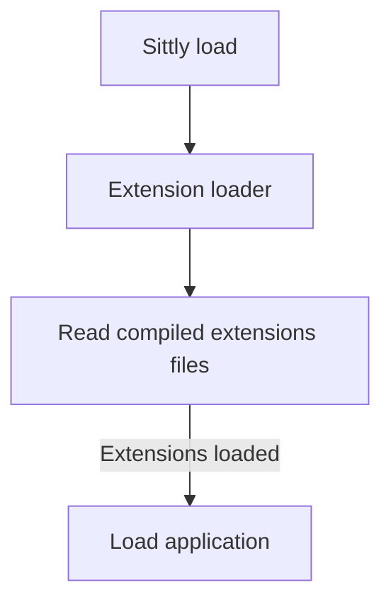

import { Steps, Callout } from "nextra/components";

## How extensions are loaded?

Each reload of the application, the extension loader will load the extensions from the compiled files.

## How extensions are compiled?

Sittly does not compile the extensions, it just load the compiled files. The extensions must be compiled and submitted to Github.
